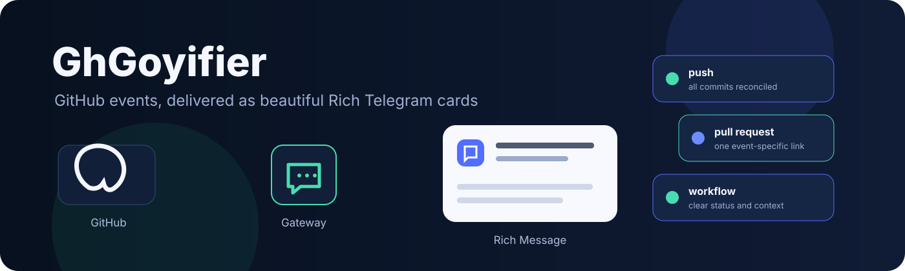

# GhGoyifier

<p align="center">
  
</p>

<p align="center">
  <strong>GitHub activity, presented as clear, rich, actionable Telegram messages.</strong><br>
  A lightweight GoyGram-based gateway for teams that want GitHub updates without a noisy notification stream.
</p>

<p align="center">
  <a href="https://github.com/sepiol026-wq/GhGoyifier"></a>
  <a href="LICENSE-AGPLv3"></a>
  <a href="https://github.com/sepiol026-wq/GhGoyifier"></a>
  <a href="https://github.com/sepiol026-wq/GhGoyifier"></a>
</p>

## Install first

The installer creates an isolated installation, asks the operator only for meaningful settings, and detects the init system available on the host.

```bash
curl -fsSL https://raw.githubusercontent.com/sepiol026-wq/GhGoyifier/main/install.sh | bash
```

The installer will:

1. clone `sepiol026-wq/GhGoyifier` into a separate application directory;
2. create a private Python virtual environment;
3. install pinned/runtime dependencies;
4. open a Rich setup wizard;
5. write a validated configuration atomically with mode `0600`;
6. install the gateway for the detected init system when possible;
7. create the global commands `ghgoyifi`, `ghgoyifier`, and `GhGoyifier`.

After installation:

```bash
ghgoyifi gateway start
ghgoyifi gateway status
ghgoyifi logs follow
```

The installer is interactive by design. Secrets are entered without echo. Technical values such as SQLite models, Telegram API defaults, polling mode, and internal runtime defaults are configured automatically rather than asked as meaningless questions.

## Why GhGoyifier?

### A calmer GitHub-to-Telegram experience

GhGoyifier turns GitHub activity into structured Telegram Rich Messages. A push is not reduced to a vague `GitHub push` line: it can include the branch, commit count, commit identifiers, authors, messages, changed files, and diff statistics. Pull requests, issues, reviews, comments, releases, workflows, deployments, discussions, forks, stars, branches, tags, and repository changes receive event-specific formatting and an event-specific link.

### Rich Messages instead of plain bot text

Cards use Telegram Rich Message structures for headings, code, expandable sections, separators, formatted bodies, and readable multi-part layouts. The transport stays Rich in both button modes:

- `inline`: native Telegram inline keyboard beside the Rich payload;
- `in-msg`: buttons rendered inside the Rich message itself.

The choice is configurable. `inline` is the default because it is familiar to Telegram users; `in-msg` is available for a more integrated card layout.

### Direct GoyGram architecture

The bot uses GoyGram directly instead of an aiogram-shaped compatibility layer. That keeps the runtime focused and avoids carrying a dialog framework, middleware stack, or unused abstraction just to deliver messages. The result is a compact, asynchronous process with low operational overhead. Actual memory and latency still depend on Python, GitHub API responses, enabled integrations, and host conditions; no synthetic benchmark is claimed here.

### Production-minded safety

Management operations are admin-gated at action time, not only when a menu is rendered. Callback payloads use short opaque authenticated handles. User tokens are encrypted at rest, lookup uses a digest, config writes are atomic, and outbound/inbound flood controls reduce repeated expensive work and Telegram rate-limit cascades.

These controls protect the application boundary. They are not a replacement for a firewall, reverse proxy, provider protection, or network-level DDoS mitigation.

## Features

<table>
<tr><td></td><td><strong>Rich event cards</strong><br>Readable headings, expandable content, code blocks, separators, detailed metadata, and one relevant URL button.</td></tr>
<tr><td></td><td><strong>Lightweight async runtime</strong><br>Direct GoyGram transport, bounded work, caching, and no unnecessary dialog framework.</td></tr>
<tr><td></td><td><strong>Defense in depth</strong><br>Encrypted secrets, opaque callback handles, admin re-checks, ownership checks, replay protection, and flood controls.</td></tr>
<tr><td></td><td><strong>Operator-first CLI</strong><br>Rich configuration wizard, config dot-path editing, gateway lifecycle commands, diagnostics, and log inspection.</td></tr>
<tr><td></td><td><strong>Many init environments</strong><br>Automatic detection for systemd, dinit, runit, OpenRC, SysVinit, s6, Upstart, BusyBox init, finit, dumb-init, minit, tiny, and Epoch.</td></tr>
</table>

Additional capabilities:

- polling GitHub Events API with cursors, watermarks, deduplication, and backoff;
- commit reconciliation through commit and compare APIs when a push payload is incomplete;
- one card containing all recovered commits from a push range;
- protection against duplicate commit titles being treated as duplicate commits;
- per-chat event switches;
- group/forum topic delivery with safe fallback to General;
- GitHub App and Personal Access Token authentication paths;
- private-chat-first repository browser and My chats management;
- admin re-checks for integration, deletion, event changes, topic changes, and reinstall actions;
- structured handling for GitHub repository, permission, token, rate-limit, and delivery errors;
- bounded Telegram message splitting;
- optional delivery-failure reporting to the integration owner;
- extensible event registry: schemas and formatters are separated by event type.

## Supported event types

| Event | Delivered when | Card contains |
|---|---|---|
| `push` | commits reach a branch | branch, complete commit range where recoverable, authors, messages, files, additions, deletions |
| `pull_request` | pull request lifecycle changes | action, title, body, actor, base/head, state, merge details |
| `issues` | issue opens, closes, reopens, assignments | issue title, action, author, body, labels, target link |
| `issue_comment` | issue or pull request comment is created | comment author, body, parent issue/PR, target link |
| `pull_request_review` | review is submitted | reviewer, review state, body, pull request target |
| `pull_request_review_comment` | inline review comment is created | reviewer, file path, line context, body, target |
| `commit_comment` | commit comment is created | author, body, commit identifier, target |
| `release` | release is published | tag, title, release notes, prerelease state, target |
| `workflow_run` | Actions workflow completes | workflow, branch, conclusion, actor, target |
| `deployment_status` | deployment status changes | environment, state, creator, target |
| `discussion` | discussion lifecycle changes | title, category, action, author, body, target |
| `discussion_comment` | discussion comment is created | author, body, discussion target |
| `star` | repository star changes | actor, action, repository, target |
| `fork` | repository is forked | actor, destination repository, fork count, target |
| `create` | branch or tag is created | reference name and type, actor, target |
| `delete` | branch or tag is deleted | reference name and type, actor, target |
| `member` | collaborator is added or changed | affected user, action, actor, repository |
| `public` | repository visibility changes | previous and new visibility, actor, target |
| `ping` | an integration is initialized | repository and integration status |

Polling is not an instantaneous delivery guarantee. The default interval is 30 seconds; GitHub API latency, rate limits, network conditions, and process availability affect delivery time.

## Configuration

Run the interactive wizard at any time:

```bash
ghgoyifi config
```

The wizard asks for operator-relevant values only:

- Telegram bot token;
- owner Telegram ID;
- button type: `inline` or `in-msg`, default `inline`;
- GitHub polling interval;
- whether anonymous access to public repositories is allowed;
- whether to configure an optional GitHub App.

Boolean questions use clear Rich prompts such as `[Y/n]` and `[y/N]`. Press Enter to retain an existing non-secret value. Secrets are hidden and never printed back.

For automation or one-field changes:

```bash
ghgoyifi config set settings.buttons inline
ghgoyifi config set notifications.poll_interval 30
ghgoyifi config rm settings.buttons
```

Technical defaults include the SQLite database, model modules, Telegram API defaults, polling mode, throttling defaults, and local gateway settings. They are written automatically and validated before saving.

## Gateway and logs

```bash
ghgoyifi gateway install
ghgoyifi gateway start
ghgoyifi gateway restart
ghgoyifi gateway enable
ghgoyifi gateway stop
ghgoyifi gateway disable
ghgoyifi gateway status

ghgoyifi logs show --lines 200
ghgoyifi logs follow
ghgoyifi logs clear
ghgoyifi doctor
ghgoyifi --version
```

The gateway detects the host init environment. Native service definitions are used where that init system has a stable service interface. On init environments without a portable service contract, GhGoyifier uses a direct supervised fallback for start, stop, restart, and status; enable/disable is reported as not applicable rather than being falsely claimed as native support.

## Telegram workflow

1. Send `/start` to the bot in private chat.
2. Use `Connect` to provide a GitHub token or configure the optional GitHub App path.
3. Use `Repos` to browse accessible accounts and repositories.
4. Add the bot to a group as an administrator.
5. Integrate a repository from the repository browser or use `/integrate owner/repository` as a group administrator.
6. Use `/integrations` and `/events` in the group to manage the integration and event selection.
7. Use `/set_topic` inside a forum topic when delivery should target that topic.

Only the author of a management command who is currently an administrator can perform group-management operations. A user who is not an administrator receives no management menu and cannot perform the operation through a stale or copied button.

## Project layout

```text
GhGoyifier/
├── __main__.py          runtime entry point and CLI dispatch
├── cli.py               Rich operator CLI and configuration wizard
├── gateway.py           init detection and service lifecycle
├── notifications.py     GitHub polling, reconciliation, and delivery
├── events/              event schemas, registry, and Rich formatters
├── handlers/            commands, callbacks, ownership, and admin checks
├── keyboards/           Telegram keyboard builders
├── db/                  Tortoise models and domain operations
├── services/             integration orchestration
└── utils/                GitHub, Telegram, security, and text helpers

assets/
├── ghgoyifier-banner.svg
└── icons/

install.sh               interactive installer
```

## Development

```bash
python3 -m venv .venv
.venv/bin/python -m pip install -r requirements.txt
PYTHONPATH=. .venv/bin/python -m compileall -q GhGoyifier
uvx ruff check GhGoyifier --select F,E9 --output-format concise
git diff --check
PYTHONPATH=. .venv/bin/python -m GhGoyifier --help
```

The project intentionally keeps the original upstream MIT attribution for inherited portions in `LICENSE`. New and modified GhGoyifier work is licensed under the GNU Affero General Public License v3.0 in `LICENSE-AGPLv3`.

## License

GhGoyifier changes are released under the [GNU Affero General Public License v3.0](LICENSE-AGPLv3).

The original upstream portions from `vsecoder/github-notifi-bot` retain their original MIT attribution and license in [LICENSE](LICENSE).
